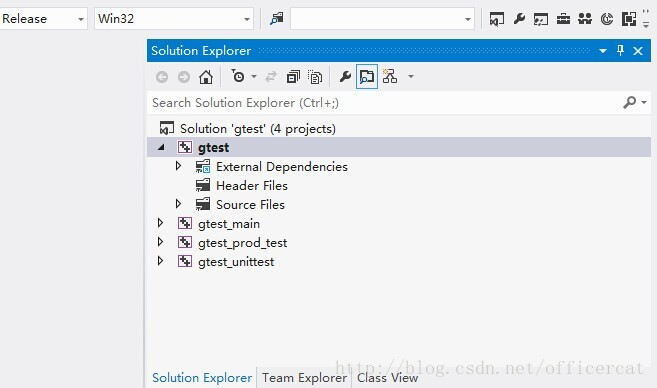

# gtest

## install gtest on Windows

1. 看到源代码文件夹里，有适应各种操作系统的编译脚本或者工程文件，比如cmake,make,msvc， msvc文件夹里就是一个支持visual studio的solution文件，打开gtest.sln，如果有需要，visual studio会自动升级我用的是visu studio 2012），可以发现里面有几个项目，其中gtest和gtest_main的产出是对google test编写有用的。

2. 通过编译器进行编译，可以分别生成Debug版本(gtestd.lib，gtest_maind.lib)和Release版本(gtest.lib，gtest_main.lib)
NOTE: error C2977 "std::tuple" too many template arguments解决方法就是在每隔工程（project）的属性中的C++  --> Preprocessor （预处理）--> preprocessor defination （预处理定义）中增加 _VARIADIC_MAX=10

 

3. 在gtest的include同目录下建立lib文件夹将生成的Debug版本(gtestd.lib，gtest_maind.lib)和Release版本(gtest.lib，gtest_main.lib)复制其中。
4. 创建链接关系：为了方便定义在环境变量中设置GTest=路径
Debug/Release通用：
项目属性 - 配置属性 - C/C++ - 常规: 附加包含目录 += \$(GTest)\include。这样方便包含GTest的头文件。
项目属性 - 配置属性 - 连接器 - 常规: 附加库目录 += $(GTest)\msvc\gtest\$(IntDir)。
Debug：
项目属性 - 配置属性 - C/C++ - 代码生成: 运行库 = 多线程调试(/MTd)。
项目属性 - 配置属性 - 连接器 - 常规: 附加依赖项 += gtestd.lib;gtest_maind.lib。
Release：
项目属性 - 配置属性 - C/C++ - 代码生成: 运行库 = 多线程(/MT)。
项目属性 - 配置属性 - 连接器 - 常规: 附加依赖项 += gtest.lib;gtest_main.lib。

参考：
1. https://blog.csdn.net/xiaqunfeng123/article/details/53188814
2. http://www.cnblogs.com/coderzh/archive/2009/03/31/1426758.html
